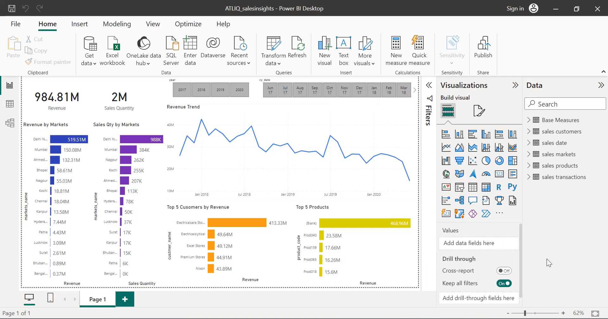
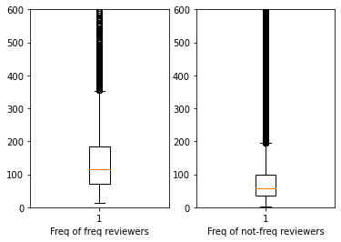

Here's an example of how you can write an appealing README file for your portfolio website:

---

# My Portfolio Website

Welcome to my portfolio website! This site showcases my projects, skills, and professional journey as a data analyst. Feel free to explore and get in touch if you'd like to discuss opportunities or collaborations.


## Table of Contents
- [About](#about)
- [Projects](#projects)
- [Skills](#skills)
- [Contact](#contact)
- [Getting Started](#getting-started)
- [Technologies Used](#technologies-used)

## About

Hello! I'm [Your Name], a data analyst with a passion for uncovering insights from complex datasets. With expertise in tools like Python, SQL, and Power BI, I create meaningful data visualizations and analyses to drive strategic decisions.

## Projects

Here are some of the projects featured on my portfolio website:

### 1. Sales Analysis Project (2017-2020)
I conducted a comprehensive sales analysis using data from 2017 to 2020, creating an interactive Power BI dashboard. The analysis included top customers, products, and markets, revealing a declining revenue trend over the period.



[View Project](https://github.com/username/sales-analysis)

### 2. Amazon Customer Data Analysis
I analyzed Amazon customer reviews using Python and various libraries, identifying key trends and conducting sentiment analysis to find top keywords for positive and negative reviews.



[View Project](https://github.com/username/amazon-data-analysis)

## Skills

- **Data Analysis:** Python, Numpy, Pandas, SQL
- **Data Visualization:** Power BI, Matplotlib
- **Database Management:** MySQL, SQLite
- **Other Tools:** Excel, Git, Jupyter Notebooks

## Contact

You can contact me at [your.email@example.com](mailto:your.email@example.com).

Connect with me on:
- [LinkedIn](https://www.linkedin.com/in/yourprofile)
- [GitHub](https://github.com/yourusername)

## Getting Started

To view this project locally:

1. Clone the repository:
   ```bash
   git clone https://github.com/yourusername/your-portfolio.git
   ```
2. Navigate to the project directory:
   ```bash
   cd your-portfolio
   ```
3. Open `index.html` in your web browser to view the website.

## Technologies Used

- **HTML**: For structuring the content of the website.
- **CSS**: For styling the website.
- **JavaScript**: For interactive elements and dynamic content.
- **GitHub Pages**: For hosting the website.

## License

This project is licensed under the MIT License. See the [LICENSE](LICENSE) file for details.

---

This README file provides an appealing and comprehensive overview of your portfolio website. It includes sections for an introduction, project highlights, skills, contact information, getting started instructions, and the technologies used. Adding images (screenshots of your projects) can make the README more visually appealing and informative.
